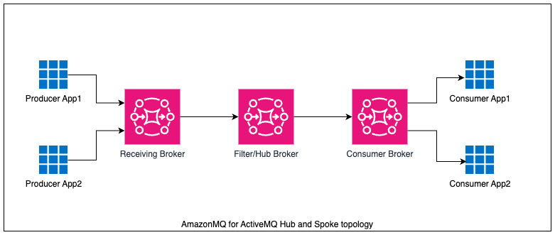
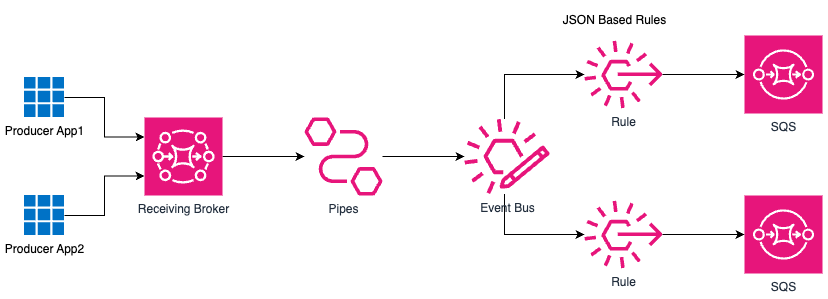

# Amazon MQ for ActiveMQ Message Filtering using Amazon EventBridge 

This pattern demonstrates how to implement message filtering for Amazon MQ for ActiveMQ queue messages and send it to respective SQS destination.

## Problem Statement



ActiveMQ's hub-and-spoke topology, especially when using filtered destinations, has notable drawbacks that can impact performance and operational efficiency. One significant issue is the high cost associated with maintaining an always-on hub broker, as it requires continuous resource consumption, leading to substantial operational expenses.

Scaling this architecture to handle increasing workloads is another challenge. As the volume of messages grows, the system often struggles to maintain high throughput, resulting in performance bottlenecks and inefficiencies. The low throughput becomes particularly problematic when dealing with large volumes of messages, making it difficult for the system to process and route messages effectively.

Debugging in this setup is also more complex. The use of intricate filtering rules complicates the process of identifying and resolving issues, making it harder for administrators to ensure smooth operations. Limited logging capabilities exacerbate this problem by restricting the amount of diagnostic information available, which is crucial for effective monitoring and troubleshooting.

Furthermore, the performance of the broker significantly degrades when filtered destinations are involved. This degradation can lead to slower message delivery times and reduced overall system efficiency, affecting the reliability and responsiveness of the messaging infrastructure. These disadvantages highlight the need for careful consideration and management when implementing ActiveMQ's hub-and-spoke topology with filtered destinations.

## Solution



Using EventBridge for filtering presents several advantages over AmazonMQ's hub-and-spoke topology. First, EventBridge leverages serverless scaling capabilities, automatically adjusting to handle varying workloads without manual intervention. This ensures that resources are used efficiently and cost-effectively. Additionally, EventBridge simplifies rule management for routing events, making configuration and maintenance easier. It supports event-driven applications with a bus-based architecture, enhancing responsiveness and flexibility. The usage-based pricing model of EventBridge is another significant benefit, as costs are based on actual message traffic, offering a more economical solution compared to the fixed costs of maintaining always-on brokers. 

Enhanced observability is achieved through integration with CloudWatch, providing comprehensive monitoring of event flows. Security is also improved with IAM policies that offer fine-grained control over access management. Moreover, with fewer brokers to manage, infrastructure overhead is significantly reduced, leading to lower operational complexity and costs. Finally, EventBridge facilitates application modernization by providing a more scalable, manageable, and efficient event-routing system, aligning with modern architectural practices.


Important: this application uses various AWS services and there are costs associated with these services after the Free Tier usage - please see the [AWS Pricing page](https://aws.amazon.com/pricing/) for details. You are responsible for any AWS costs incurred. No warranty is implied in this example.


### Requirements

* [Create an AWS account](https://portal.aws.amazon.com/gp/aws/developer/registration/index.html) if you do not already have one and log in. The IAM user that you use must have sufficient permissions to make necessary AWS service calls and manage AWS resources.
* [AWS CLI](https://docs.aws.amazon.com/cli/latest/userguide/install-cliv2.html) installed and configured
* [Git Installed](https://git-scm.com/book/en/v2/Getting-Started-Installing-Git)
* [AWS Cloud Development Kit](https://docs.aws.amazon.com/cdk/v2/guide/getting_started.html) installed
* [Python 3.x Installed](https://www.python.org/) Python 3.x installed with pip.

## Getting Started
The entire solution is built using the AWS Cloud Development Kit (CDK) in Python. The instructions below shows how solution works, deployment instructions, testing steps and cleanup.

### How it works

For more informations: [Amazon EventBridge Pipes with Amazon MQ ](https://docs.aws.amazon.com/eventbridge/latest/userguide/eb-pipes-mq.html) 

### Deployment Instructions

1. Create a new directory, navigate to that directory in a terminal and clone the GitHub repository:

2. Change directory to the pattern directory:
    ```
    cd amazonmq-for-activemq-integration-with-amazon-redshift
    ```

3. Once the repository is cloned open terminal on project directory and create a virtualenv on MacOS and Linux:
    ```
    python3 -m venv .venv
    ```

4. After the init process completes and the virtualenv is created, you can use the following step to activate your virtualenv.
    ```
    source .venv/bin/activate
    ```

    In Windows platform, you would activate the virtualenv like this:
    ```
    .venv\Scripts\activate.bat
    ```

5. Once the virtualenv is activated, you can install the required dependencies.
    ```
    pip install -r requirements.txt
    ```

6. At this point, you can now synthesize the CloudFormation template for this code.
    ```
    cdk synth
    ```

7. Once the synthesize is successful, deploy this stack
    ```
    cdk deploy
    ```
## Testing Steps

1. To retrieve the Amazon MQ for ActiveMQ broker credentials from AWS Secert Manager, run the below CLI command and replace the `--secret-id` with Secret ARN from CDK deployment output

    ```
    aws secretsmanager get-secret-value --secret-id <Secret ARN> --query SecretString --output text
    ```
    
    Sample output response:
    ```
    {"password":"W)kD3oO)bbd$y1AA","username":"admin"}

    ```

2. Send message to AmazonMQ broker using below command,

    ```
    python3 "./amazonmq_client/producer.py" <Producer Broker Host> <User_Name> '<Password>'
    ```

3. Receive message from respective SQS queue.

    ```
    aws sqs receive-message --wait-time-seconds 10 --queue NEW_APPLICATION_A_CANADA
    aws sqs receive-message --wait-time-seconds 10 --queue NEW_APPLICATION_B_CANADA
    aws sqs receive-message --wait-time-seconds 10 --queue NEW_APPLICATION_C_CANADA
    aws sqs receive-message --wait-time-seconds 10 --queue NEW_APPLICATION_D_CANADA
    aws sqs receive-message --wait-time-seconds 10 --queue NEW_APPLICATION_E_CANADA
    ```

    *Note*: EventBridge Pipes stores ActiveMQ queue messages in based64-encoded format

## Cleanup 

1. To cleanup/delete resources created while deploying the solution, go to the root folder of the project repository and run 
    ```
    cdk destroy
    ```

You will then be prompted to confirm that you want to proceed with deleting all the stacks. This will begin the process of decommissioning the resources.

### Useful commands

 * `cdk ls`          list all stacks in the app
 * `cdk synth`       emits the synthesized CloudFormation template
 * `cdk deploy`      deploy this stack to your default AWS account/region
 * `cdk diff`        compare deployed stack with current state
 * `cdk docs`        open CDK documentation
----
Copyright 2024 Amazon.com, Inc. or its affiliates. All Rights Reserved.

SPDX-License-Identifier: MIT-0