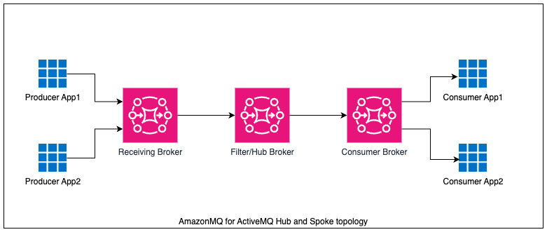
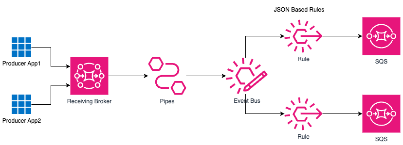

# Amazon MQ for ActiveMQ Message Filtering using Amazon EventBridge

This pattern demonstrates how to implement message filtering for Amazon MQ for ActiveMQ queue messages and send it to respective SQS destination.

## Problem Statement

ActiveMQ's hub-and-spoke topology, especially when using filtered destinations, has notable drawbacks that can impact performance and operational efficiency. One significant issue is the high cost associated with maintaining an always-on hub broker, as it requires continuous resource consumption, leading to substantial operational expenses.

Scaling this architecture to handle increasing workloads is another challenge. As the volume of messages grows, the system often struggles to maintain high throughput, resulting in performance bottlenecks and inefficiencies. The low throughput becomes particularly problematic when dealing with large volumes of messages, making it difficult for the system to process and route messages effectively.

Debugging in this setup is also more complex. The use of intricate filtering rules complicates the process of identifying and resolving issues, making it harder for administrators to ensure smooth operations. Limited logging capabilities exacerbate this problem by restricting the amount of diagnostic information available, which is crucial for effective monitoring and troubleshooting.

Furthermore, the performance of the broker significantly degrades when filtered destinations are involved. This degradation can lead to slower message delivery times and reduced overall system efficiency, affecting the reliability and responsiveness of the messaging infrastructure. These disadvantages highlight the need for careful consideration and management when implementing ActiveMQ's hub-and-spoke topology with filtered destinations.

## Solution

Using EventBridge for filtering presents several advantages over AmazonMQ's hub-and-spoke topology. First, EventBridge leverages serverless scaling capabilities, automatically adjusting to handle varying workloads without manual intervention. This ensures that resources are used efficiently and cost-effectively. Additionally, EventBridge simplifies rule management for routing events, making configuration and maintenance easier. It supports event-driven applications with a bus-based architecture, enhancing responsiveness and flexibility. The usage-based pricing model of EventBridge is another significant benefit, as costs are based on actual message traffic, offering a more economical solution compared to the fixed costs of maintaining always-on brokers.

Enhanced observability is achieved through integration with CloudWatch, providing comprehensive monitoring of event flows. Security is also improved with IAM policies that offer fine-grained control over access management. Moreover, with fewer brokers to manage, infrastructure overhead is significantly reduced, leading to lower operational complexity and costs. Finally, EventBridge facilitates application modernization by providing a more scalable, manageable, and efficient event-routing system, aligning with modern architectural practices.

Important: this application uses various AWS services and there are costs associated with these services after the Free Tier usage - please see the [AWS Pricing page](https://aws.amazon.com/pricing/) for details. You are responsible for any AWS costs incurred. No warranty is implied in this example.